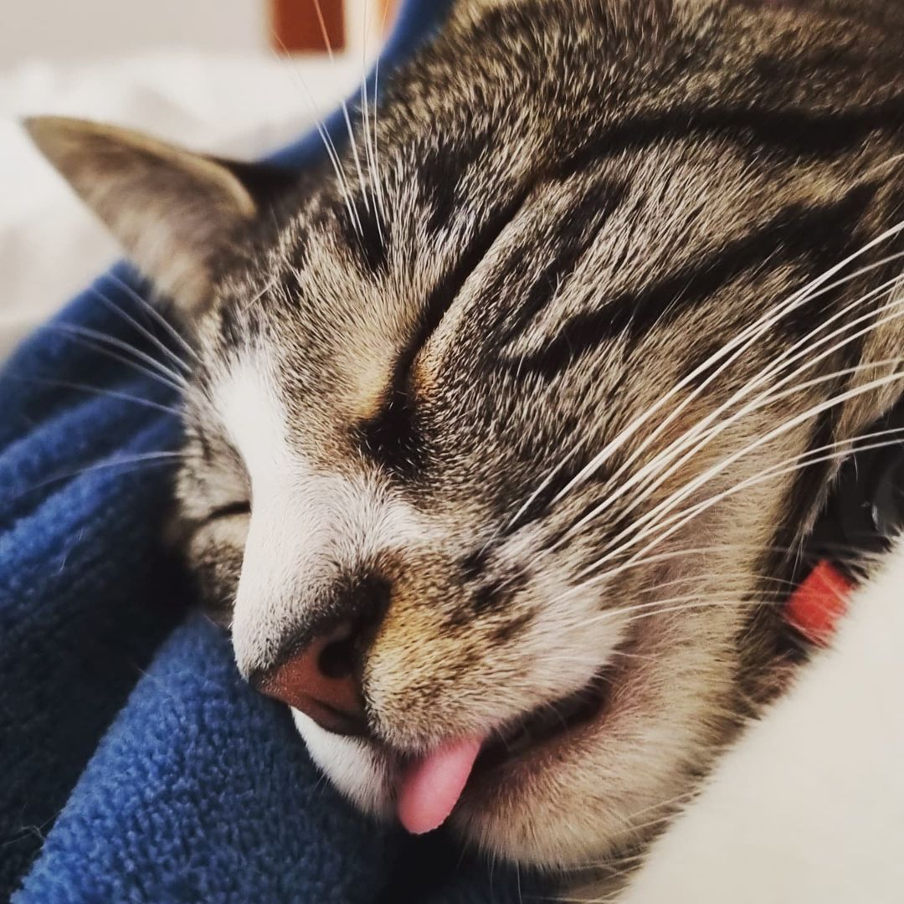
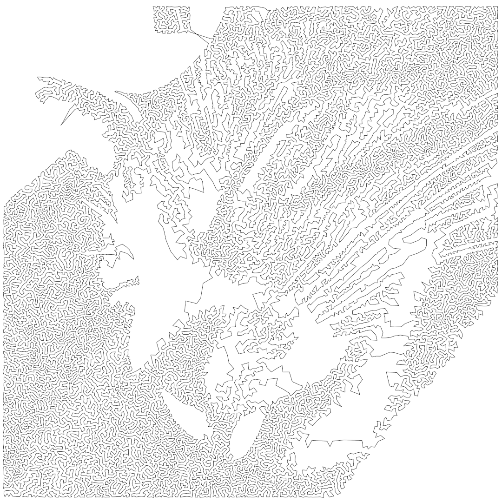

# Traveling Salesman Problem (TSP) Art

A Python application that allows people to create their own TSP Art (art constructed by solving instances of the Traveling Salesman Problem).


## How to install

This application uses [LKH-3](http://webhotel4.ruc.dk/~keld/research/LKH-3/) solver, an implementation of the Lin-Kernighan heuristic implemented by K. Helsgaun. Please, visit [LKH-3](http://webhotel4.ruc.dk/~keld/research/LKH-3/) page to see how to install it.

Windows users do not need to install LKH-3, since a stand-alone executable for Windows machines is already included on the installation.

To install TSP Art application, clone (or download) the repository:
```
git clone https://github.com/andremaravilha/tsp-art
cd tsp-art
```

Then run:
```
pip install .
```

Now you can create your own TSP Art!


## How to use

You just need to set the number of nodes for the resulting TSP instance (larger numbers will require more memory and time), the input image, and the name to the output file with the TSP Art:

```
tsp-art --nodes 25000 gata.jpg gata_tour_25k.png
```

Supported formats to output files are: PNG, PDF, EPS, and SVG. All you need to do is to change the extension on the name of the output file.

| Original image | TSP Art (25k nodes) |
| --- | --- |
|  |  |

Additional options are described bellow:

- `--draw-instance <FILE>`: Create an image with nodes from the resulting TSP instance. Supported formats are PNG, PDF, EPS and SVG.
- `--export-instance <FILE>`: Export the resulting TSP instance to a file with TSPLIB format.
- `--export-tour <FILE>`: Export the tour to a file with TSPLIB format.

## License

TSP Art is licensed under MIT license. Note that LKH-3 are released under a different license.


## Interesting links

[Robert (Bob) Bosch - TSP Art Website](https://www2.oberlin.edu/math/faculty/bosch/tspart-page.html)  
[Robert (Bob) Bosch - Making TSP Art](https://www2.oberlin.edu/math/faculty/bosch/making-tspart-page.html)  
[Craig S. Kaplan - TSP Art](https://cs.uwaterloo.ca/~csk/other/tsp/)  
